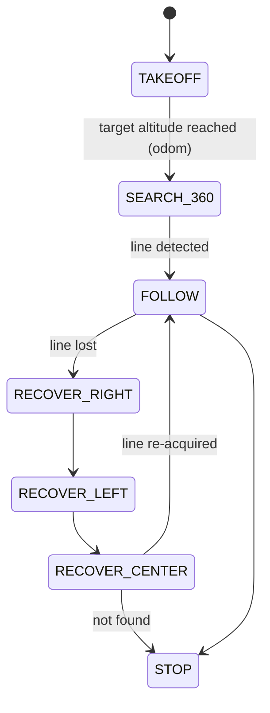

<div align="center">

# 🕳️ Drone Gazebo Cave Simulation

**Indoor (GPS-denied) UAV simulation in Gazebo with a vision-based line-following autopilot, built on ROS 2.**


</div>

---

## ✨ Overview

A quadcopter with a camera, IMU and 3D LiDAR flies inside a **cave world**. A computer-vision node segments a guide line on the ground from the downward camera; a state-machine controller takes off to a target altitude, searches for the line and follows it, recovering automatically when the line is lost. Developed as part of a TÜBİTAK 1001 / AFAD autonomous UAV research project for indoor search-and-rescue scenarios.

## 🧩 Packages

| Package | Role |
|---|---|
| `drone_model` | Quadcopter SDF model with camera, IMU and LiDAR · `cave1.sdf` world |
| `sim_bringup` | Launches Gazebo, `ros_gz_bridge`, odometry from Gazebo pose, IMU frame fix, static TFs and **Foxglove** bridge |
| `line_follower` | `line_segment_node` (OpenCV) + `line_follower_node` (flight state machine) |

## 🧠 Line-following autopilot



- **Perception** — `/x3/camera/image_raw` → thresholding + morphology → filtered lateral error (`line_error`) and `line_confidence`
- **Control** — P-controller on altitude from `/odom`, yaw / lateral correction from line error, publishes `/model/M100/cmd_vel`

## 🔌 Bridged topics

`/clock` · `/m100/imu` · `/x3/camera/image_raw` · `/x3/lidar/points` · `/model/M100/cmd_vel` · `/world/cave/dynamic_pose/info`

## 🚀 Getting Started

```bash
cd ~/ros2_ws && colcon build && source install/setup.bash

ros2 launch sim_bringup sim_bringup.launch.py      # Gazebo + bridges + Foxglove (ws://localhost:8765)
ros2 run line_follower line_segment_node
ros2 run line_follower line_follower_node
```

---

<div align="center">
Built by <a href="https://github.com/Bariscompeng">Barış Coşkun</a>
</div>
